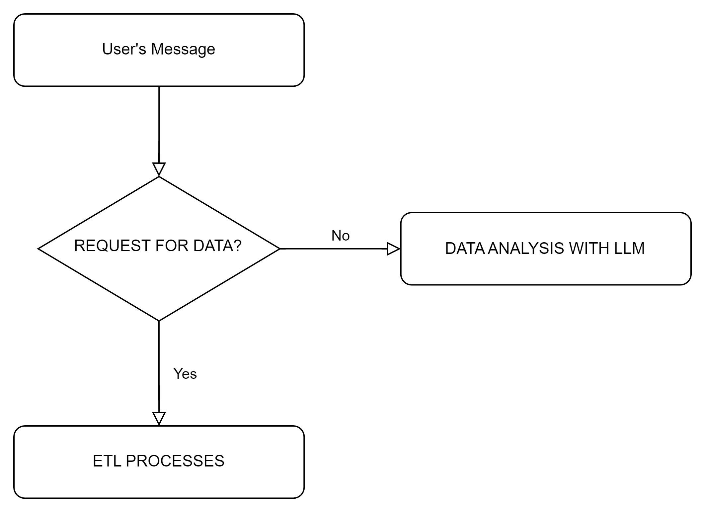
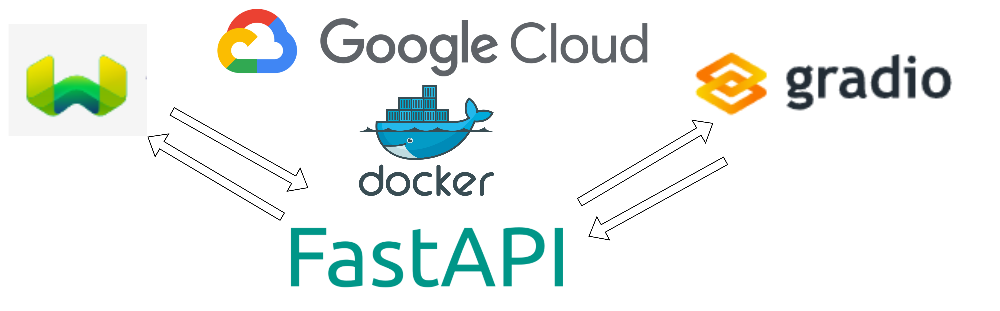

# FINBOT

## Techstack

**BACKEND**
- **DOCKER**
- **LANGCHAIN**
- **FASTAPI**
- **GOOGLE DOCUMENT AI**
- **WEAVIATE**

**FRONTEND**
- **DOCKER**
- **GRADIO**

__**The end goal is to extract out skills in job ads and resume.**__

## LOGIC OF RETRIEVAL:

The LLM (Llama3-70b) is used as an orchestrator. It determines if a user's question should activate tools from either extract and retrieval (ETL) types or RAG retrieving.



## Overview of architecture:

**Considerations**:
- software scalability - addition of more functionality, modularity
- accuracy - accuracies of tooling
- jobs scalability - scaling of resources based on workload



## Comments:
- Gradio serves only as an interim chat interface
- Serving the app as an api allows for space to implement message queue
- weaviate is used as it provides multiple plugins for more complex vector search algorithms

## Significant Software decision:
- Number of document ocr was tried (e.g. yolox, tesserect) before settling on using google documentai for pdf parsing. This is due to documentai having the best performance on edgar fillings. Nonetheless while better than SOTA, the results are still to be desired.
- Current implementation avoided streaming and async methods to increase time for code to staging.
- A number of free apis are used, e.g. convertai for htm files to pdf. This decision is made deliberately as it offloads as much processing time for ETL to other computes.
- docker compose on gcp vm for deployment due to fast deployment and portability

## RAG decisions:
- Reranking was used, where a different model will rank documents retrieved from first model. This technique improves results as different models may be biased to different words and sentences.
- Hybrid search of weighting scores from semantic scores and word level distance score. This allows both words and meaning to be used in retrieval.
- Grounding is done by returning all referenced materials and agentic prompts. Users are warned if tables are referenced as errors carried from OCR parsing may result in corrupted data.
- Langchain was used to adopt a agentic approach as the framework allows the ease of adding tools and hence functionalities.

## Evaluation:
- Evaluation is not implemented in this submission due to time constraint and confidence level in data.
    - Non-Trivial blockers:
        - Problem:
            - tables are difficult to parse.
        - Possible Solution:
            - finetuning
        - Problem:
            - what constitute as a good result for our user?
        - Possible Solution:
            - implement design thinking methodology and pinpoint how and kind of response user wants.
        - Problem:
            - How to factor in errors carried forward from document parsing.
        - Possible Solution:
            - documentai returns confidence score per section parsed. through large dataset testing we can implement a weighting of confidence score from documentai and other metrics we implement.


## Installation

1. Clone the repository:
```
    git clone https://github.com/PaulSZH95/qiong.git
```

2. Install [docker](https://docs.docker.com/engine/install/)

3. Ensure you are at the root of the repository. I.e. folder name: qiong

5. declare abspath variable.
```
    powershell:
    $env:abspath = $(pwd)
```
```
    Linux:
export abspath = $(pwd)
```

6. declare COHERE_APIKEY variable.
```
    powershell:
    $env:COHERE_APIKEY = <API>
```
```
    Linux:
    export COHERE_APIKEY = <API>
```


6. Run docker compose up.
```
    docker compose up -d
```

7. Access gradio from browser.
```
    http://localhost:7860
```

To try out the demo app please visit http://35.192.106.51:7860/